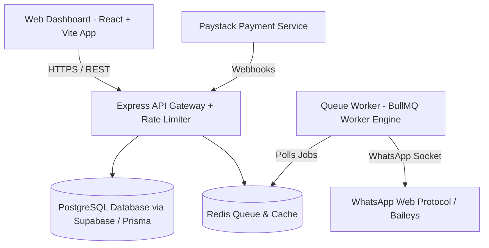

# StatusFlow - Architecture Overview

## Production Readiness Architecture
- **Error Boundaries**: React `<ErrorBoundary>` component captures top-level frontend exceptions.
- **Rate Limiting**: Express middleware (`rateLimiter.ts`) enforcing 100 requests per 15 mins window per IP.
- **CI/CD Pipeline**: GitHub Actions (`.github/workflows/ci-cd.yml`) executing typechecking, linting, Vitest tests, and automated Docker deployment.
- **Database Backup**: Automated shell script (`scripts/backup_database.sh`) executing `pg_dump` with S3 vault offsite archiving.
