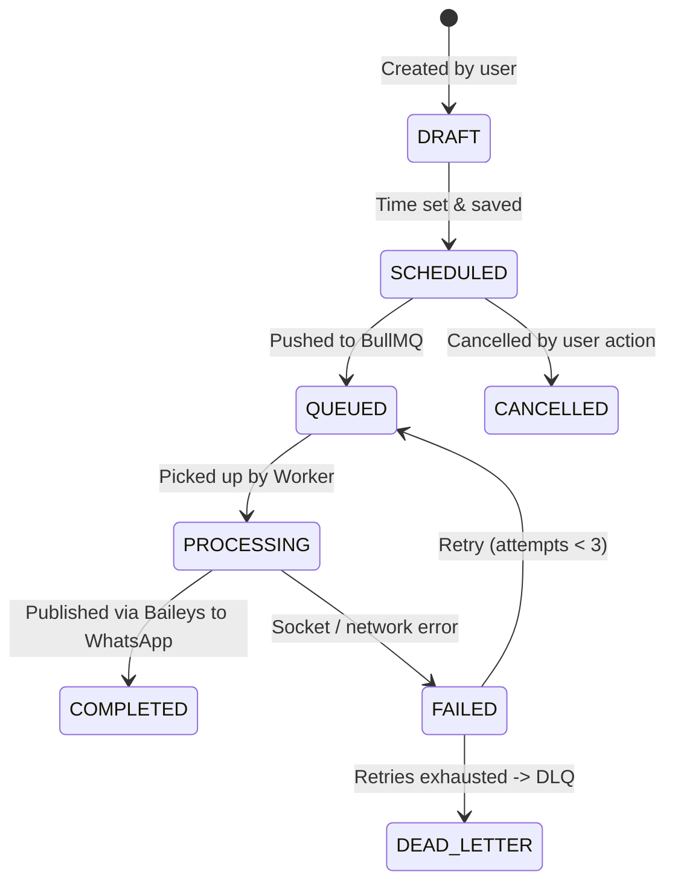

# Status Posting Job Lifecycle

```mermaid
stateDiagram-v2
    [*] --> DRAFT: Created by user
    DRAFT --> SCHEDULED: Time set & saved
    SCHEDULED --> QUEUED: Pushed to BullMQ
    QUEUED --> PROCESSING: Picked up by Worker
    PROCESSING --> COMPLETED: Published via Baileys to WhatsApp
    PROCESSING --> FAILED: Socket / network error
    FAILED --> QUEUED: Retry (attempts < 3)
    FAILED --> DEAD_LETTER: Retries exhausted -> DLQ
    SCHEDULED --> CANCELLED: Cancelled by user action
```
