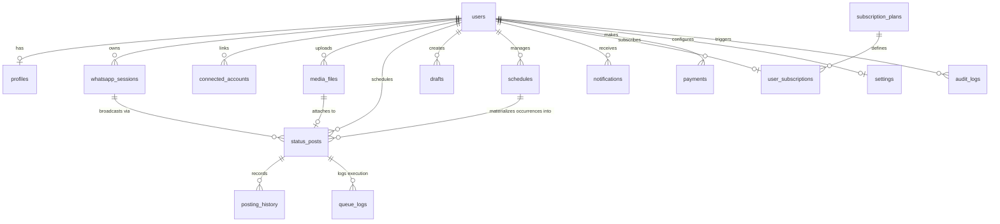

# StatusFlow - Database Entity Relationship Diagram (ERD)

```mermaid
erDiagram
    users ||--o| profiles : "has"
    users ||--o{ whatsapp_sessions : "owns"
    users ||--o{ connected_accounts : "links"
    users ||--o{ media_files : "uploads"
    users ||--o{ status_posts : "schedules"
    users ||--o{ drafts : "creates"
    users ||--o{ schedules : "manages"
    users ||--o{ notifications : "receives"
    users ||--o| user_subscriptions : "subscribes"
    users ||--o{ payments : "makes"
    users ||--o| settings : "configures"
    users ||--o{ audit_logs : "triggers"

    subscription_plans ||--o{ user_subscriptions : "defines"
    whatsapp_sessions ||--o{ status_posts : "broadcasts via"
    media_files ||--o| status_posts : "attaches to"
    status_posts ||--o{ posting_history : "records"
    status_posts ||--o{ queue_logs : "logs execution"
    schedules ||--o{ status_posts : "materializes occurrences into"
```
